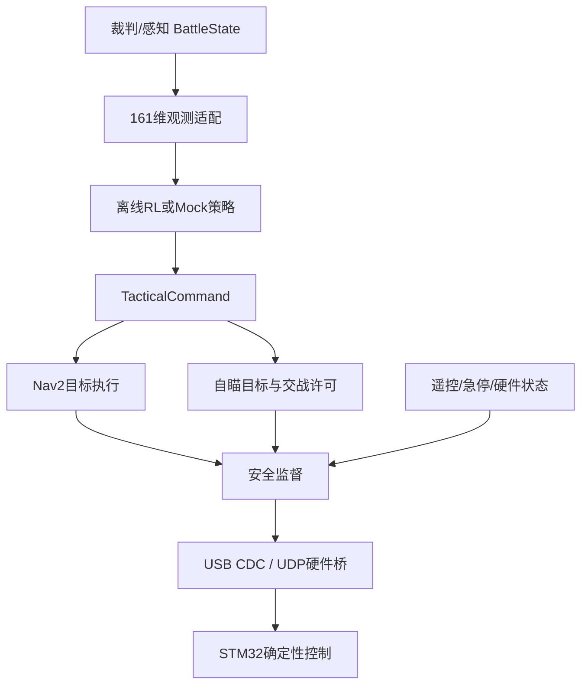

# 哨兵全流程架构

> 本文件是目标架构与接口边界，不代表所有运行阶段已经通过验收。当前状态以
> [PROJECT_STATE.md](PROJECT_STATE.md)、[TOPIC_CONTRACT.md](docs/TOPIC_CONTRACT.md)
> 和 [TEST_GATES.md](docs/development/TEST_GATES.md) 为准。

## 1. 分层边界

| 层 | 频率 | 输入 | 输出 | 不负责 |
|---|---:|---|---|---|
| 战术策略 | 1 Hz | 161 维战场观测 | 子目标、目标槽位、交战许可 | 电机、云台角速度、扣扳机时刻 |
| 任务调度 | 1–10 Hz | 裁判状态、目标、健康状态 | 模式、任务、Nav2 action | 直接闭环控制 |
| 导航/自瞄 | 20–200 Hz | 地图、点云、图像、战术命令 | 速度、瞄准量、发射请求 | 学习长期战术 |
| 安全监督 | 50–100 Hz | 所有命令、硬件状态 | 钳制后的唯一执行命令 | 提升策略收益 |
| 固件控制 | 500–1000 Hz | 速度/角度参考 | CAN/PWM/电机力矩 | 全局规划 |

## 2. ROS 2 数据流



`/sentry/cmd_vel_safe` 是底盘唯一允许执行的 ROS 速度话题；任何调试节点都不应直接
绕过安全监督向硬件桥发命令。

## 3. 三种模式

| 模式 | 时钟 | 里程计/传感器来源 | 执行端 |
|---|---|---|---|
| `sim` | `/clock` | Isaac Sim 或 mock | 仿真机器人 |
| `hil` | 系统时间 | 仿真感知 + 真实/台架控制器 | UDP/串口 |
| `real` | 系统时间 | MID360、相机、定位、裁判系统 | USB CDC/串口 |

模式只替换“端口”，不替换上层业务接口。这一做法借鉴了 `dp_sdk_core` 将 OS/HAL
差异集中到适配层的思路。

## 4. 训练与部署

### 离线阶段

`training/RMUC-OfflineRL` 从官方 SQLite 日志构建 161 维观测和 10 维战术动作：

- 2 维：约 5 秒后的导航子目标偏移；
- 1 维：是否允许交战；
- 7 维：六类敌方槽位加“无目标”。

优先用人类步兵数据训练并迁移到哨兵，但必须在实车可观测条件下重新做遮罩训练。

### Isaac Lab 在线阶段

训练内环直接在 GPU 张量上运行。每个 episode 或固定间隔将摘要发布给 ROS 2，供：

- 实验启停；
- 参数/场景版本记录；
- 评估回放；
- HIL/实车策略切换。

策略导出后再进入 `sentinel_core.policy_node`。这样训练和部署共享观测/动作契约，但
训练吞吐不依赖 DDS。

## 5. 安全约束

安全监督至少执行：

1. 急停锁存；
2. `real/hil` 模式硬件心跳超时即零力；
3. Nav2/遥控命令超时即速度归零；
4. 速度、角速度和加速度限幅；
5. 弹药耗尽、枪管热量余量不足、硬件离线时撤销 `weapons_free`；
6. 无目标时禁止交战；
7. 固件再次重复相同约束。

学习策略不能成为最后一道安全防线。

## 6. 坐标系

统一使用 REP-105 风格：

```text
map -> odom -> base_link -> lidar_link
                         -> camera_link
                         -> gimbal_yaw_link -> gimbal_pitch_link -> barrel_link
```

上传包原配置使用 `World` 和 `lidar` 作为 Nav2 主坐标系，本工程已改成标准
`map/odom/base_link`。Isaac Sim 场地坐标必须通过静态变换或 USD 根节点旋转与此定义
对齐，禁止在各节点里分别加魔法偏移。
