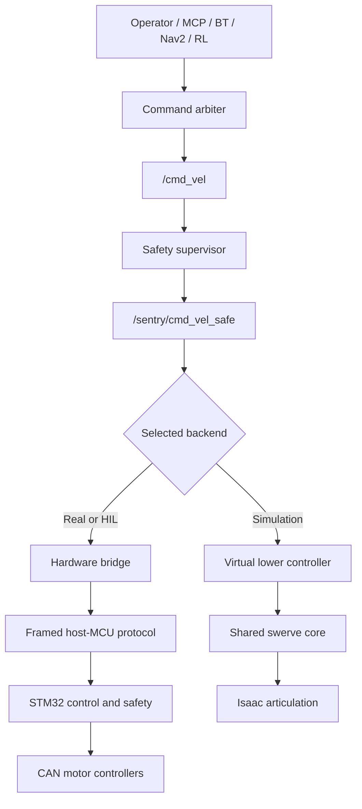
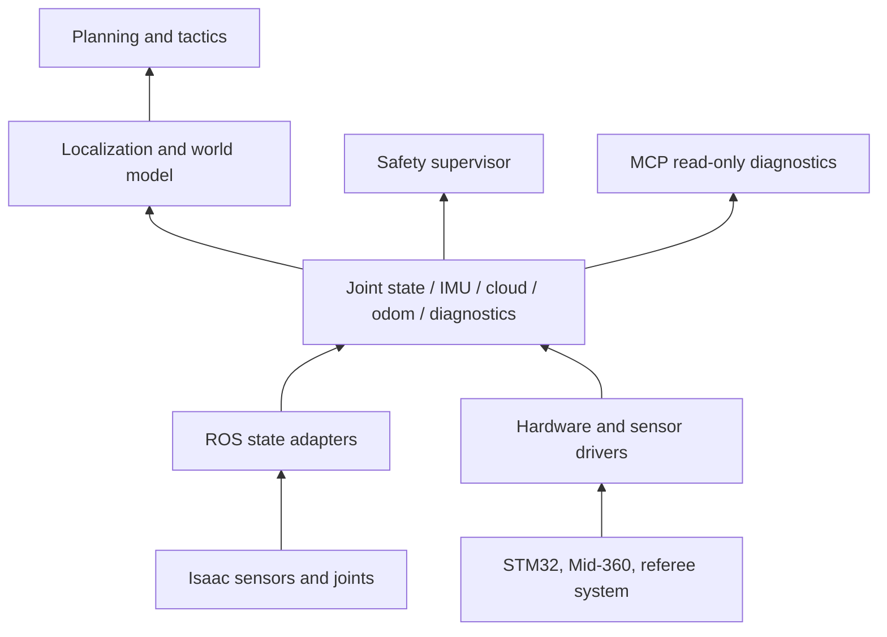
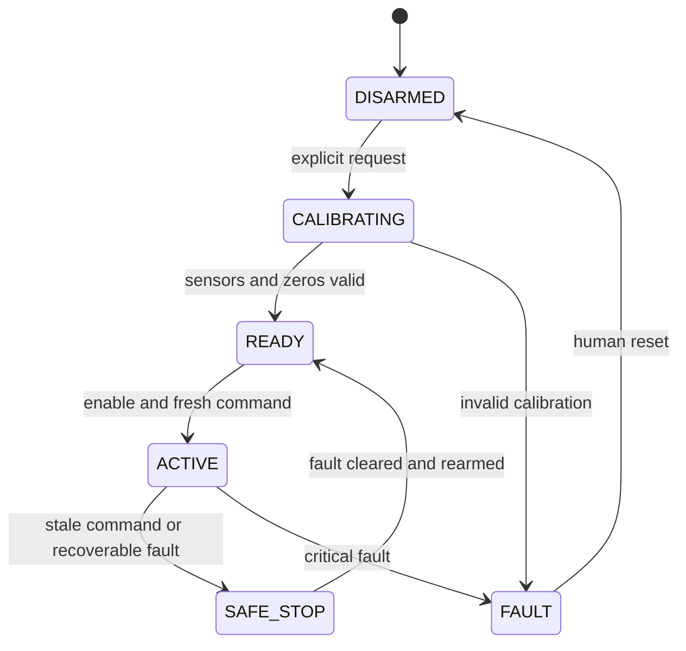

# Complete control flow

This document is the canonical end-to-end path for simulation, HIL, and the real robot.

## Command path

There is one non-negotiable boundary:

> Every high-level motion source publishes to `/cmd_vel`; only `safety_supervisor` may publish `/sentry/cmd_vel_safe`.

MCP is not a new motor controller. It can inspect ROS state and, during an explicitly enabled test, use the same `/cmd_vel` entrance as teleop or navigation. It must not publish directly to safe-command, joint, current, PWM, or CAN interfaces.

## Feedback path

## Backend selection

| Layer | Simulation | Real robot |
|---|---|---|
| Command source | same `/cmd_vel` interface | same `/cmd_vel` interface |
| Safety boundary | `/sentry/cmd_vel_safe` | `/sentry/cmd_vel_safe` |
| Backend | virtual lower controller | hardware bridge |
| Kinematics | `sentinel_common` | the same source compiled for MCU, or a bit-for-bit verified port |
| Feedback | Isaac joints and sensors | CAN encoders, MCU IMU, Mid-360, referee system |
| Actuation | articulation targets | cascaded loops and CAN current commands |
| Time | `/clock`, `use_sim_time=true` | monotonic host/MCU clocks, `use_sim_time=false` |

Exactly one backend is enabled for an actuator set. Running the simulation writer and real hardware writer together is a configuration error.

## Command arbitration

The arbiter accepts mutually exclusive sources:

1. emergency stop and fault override;
2. authorized manual debug;
3. autonomous navigation or behavior tree;
4. policy residual, if the relevant Gate has passed.

Every command carries or is associated with source, sequence, timestamp, mode, frame, and enable state. Stale or ambiguous ownership results in zero motion.

## Safety layers

| Layer | Required behavior |
|---|---|
| Planner/policy | obey semantic zones and planned limits; may fail safely but is not trusted as the final guard |
| ROS safety supervisor | source arbitration, kinematic limits, acceleration limits, collision/TTC checks, localization health, estop |
| Hardware bridge | validates ranges, sequence, framing, CRC, and MCU freshness |
| STM32 | final watchdog, limits, motor offline detection, gimbal limits, current/power fallback, emergency stop |
| Motor controller/referee power path | hardware protection and competition power enforcement |

Safety is deliberately layered. Control authority is not duplicated: one node still owns each final output.

## Initial timing budget

These are starting requirements, not measured guarantees:

| Segment | Initial target |
|---|---:|
| STM32 control loop | 1000 Hz |
| Host safe command | 100 Hz |
| Full MCU telemetry | 100-200 Hz |
| Diagnostics/fault summary | 20-50 Hz |
| Host command stale | zero targets after 100 ms |
| Host command lost | disable or safe hold after 500 ms |

Measure end-to-end wall time as well as simulation time. A fast topic rate under slow real-time factor does not prove low real-world latency.

## State transitions

An emergency stop has priority over every transition and command source.
